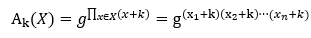
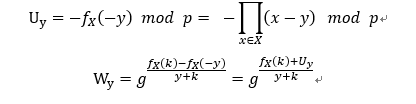
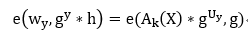
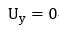
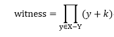

# 基于双线性对的聚合器

## 参考论文
Supporting Non-membership Proofs with Bilinear-map Accumulators.pdf
k是私钥 h=g^k是公钥
## 五个算法
* 算法1：计算一个集合的accumulator
  
  其中k是私钥，X是要聚合的集合，x是X中的元素

* 算法2：计算某元素的witness
  

* 算法3：判断一个元素是否在集合中
  需要判断两件事：
  
  如果不成立，则说明用户提交了一个非法的请求
  
  如果成立，则y在X中；否则y不在X中

* 算法4：计算一个集合的witness
  
* 算法5：判断一个集合Y是不是集合X的子集 