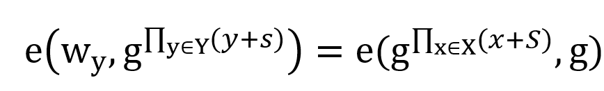

# 2018.9.20问王师姐

> 聊天记录见文件夹 和师姐的聊天记录

1. 聚合器的作用是什么
2. 服务器需要同时有Acc 和 S才能给出证据

# 基于双线性对的聚合器

动态聚合器：每个witness可以提供一个高效的密码学证据，证明元素在集合X中。当集合X中元素插入或删除时，相应的 聚合值 和 witness 均会发生变化。

## 参考论文

Supporting Non-membership Proofs with Bilinear-map Accumulators.pdf

## 算法一：生成公私钥

私钥={生成元g，Zr域中的一个随机元素k}
公钥={$$ g^k, g^{k^2}, g^{k^3}, ... $$}

## 算法二：计算一个集合的accumulator

其中k是私钥，X是要聚合的集合，x是X中的元素

## 算法三：计算某元素的witness

## 算法四：验证元素的witness

需要判断两件事：

如果不满足，则说明用户提交了一个非法的请求

如果满足，则该witness成立；否则该witness不成立

## 算法五：计算某元素的Non-Witness
同算法三

## 算法六：验证元素的non-witness
将算法四取反

## 算法七：计算一个集合的witness

## 算法八：验证集合witness

如果满足，则witness成立；否则不成立